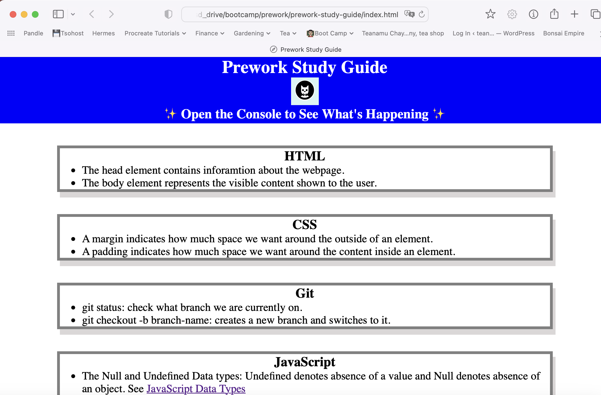

# Prework Study Guide Webpage

## Description

This prework study guide webpage is the pre-requisite course work for the Front-End Web Dev Boot Camp course. 

It is a rudimentory webpage that acts as a note taking facility to accompany the course. Through this prework, we were introduced to basic HTML, CSS, JScript and Git.

## Table of Contents (Optional)

- [Installation](#installation)
- [Usage](#usage)
- [Credits](#credits)
- [License](#license)

## Installation

Not applicable.

## Usage

The HTML file has several sections relating to topics learnt in HTML, CSS, Git and JScript respectively.  

## Credits

Not applicable.

## License

Please refer to the LICENSE in the repo.

